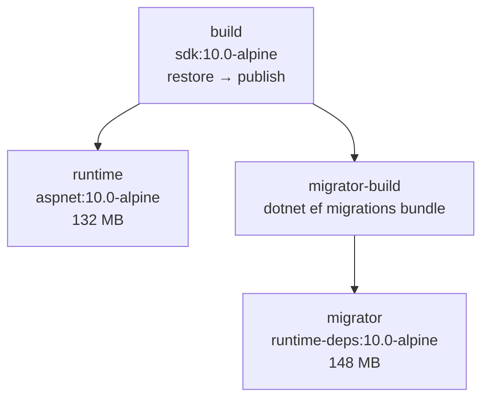

# .NET Production Dockerfile

> One Dockerfile, three stages you ship or reuse: `runtime` (the API), `migrator` (EF bundle), `build` (tests).

## Problem
The API and its migrations need different images — but must come from the **same** commit and build.



## Example — [examples/02-dotnet-api/Dockerfile](../../examples/02-dotnet-api/Dockerfile)
```dockerfile
FROM mcr.microsoft.com/dotnet/sdk:10.0-alpine AS build
COPY src/Api/Api.csproj src/Api/
RUN --mount=type=cache,id=nuget,target=/root/.nuget/packages dotnet restore src/Api/Api.csproj
COPY . .
RUN --mount=type=cache,id=nuget,target=/root/.nuget/packages \
    dotnet publish src/Api/Api.csproj -c Release --no-restore -o /app

FROM build AS migrator-build
RUN --mount=type=cache,id=nuget,target=/root/.nuget/packages \
    dotnet tool restore \
 && dotnet ef migrations bundle -p src/Api -r linux-musl-x64 --self-contained -o /efbundle

FROM mcr.microsoft.com/dotnet/runtime-deps:10.0-alpine AS migrator
COPY --from=migrator-build /efbundle /efbundle
USER $APP_UID
ENTRYPOINT ["/efbundle"]

FROM mcr.microsoft.com/dotnet/aspnet:10.0-alpine AS runtime
RUN mkdir -p /app/keys && chown $APP_UID:$APP_UID /app/keys
COPY --from=build --chown=$APP_UID:$APP_UID /app .
ARG APP_VERSION=dev
ENV APP_VERSION=$APP_VERSION DataProtection__KeysPath=/app/keys
USER $APP_UID
HEALTHCHECK --interval=10s --timeout=3s --start-period=10s --retries=3 \
  CMD wget -qO- http://localhost:8080/health || exit 1
ENTRYPOINT ["dotnet", "Api.dll"]
```

## Every Choice — with evidence
| Line | Why |
|---|---|
| `-alpine` bases | 0 CVEs vs 14–41 ([28](../06-modern-tools/28-trivy.md)) |
| `.csproj` first + cache mount | Restore cached ([07](../02-images/07-layers-cache.md)) |
| Separate `migrator` target | No SDK in prod; runs once ([33](33-ef-migrations.md)) |
| `mkdir /app/keys && chown` | Else `Permission denied` on the volume ([14](../04-data-network/14-volumes.md)) |
| `ARG APP_VERSION` after `COPY` | Tag visible at `GET /` without busting the cache |
| `USER $APP_UID` | uid 1654, not 0 |
| `wget` healthcheck | Alpine has it; Ubuntu image doesn't |

## Globalization Decision
| Option | Image size (measured, hello app) | Arabic dates/numbers (`ar-SA`) — per .NET docs |
|---|---|---|
| Default Alpine (`DOTNET_SYSTEM_GLOBALIZATION_INVARIANT=true`, verified in image env) | 123 MB | ❌ invariant culture only |
| `apk add icu-libs icu-data-full` + `…INVARIANT=false` | 161 MB (+38 MB) | ✅ |

## Key Points
- `--target runtime` / `--target migrator`
- Same commit → same tag for both
- `.dockerignore` excludes `tests/`, `.env`

## Pitfall
❌ `dotnet tool restore` without the cache mount, then `dotnet ef` with it → ✅ The mount hides the restored tool; run both in the **same** `RUN`

---
← [30 VPS Setup](30-vps-setup.md) · [Next → 32 compose.prod.yml](32-compose-prod.md)
