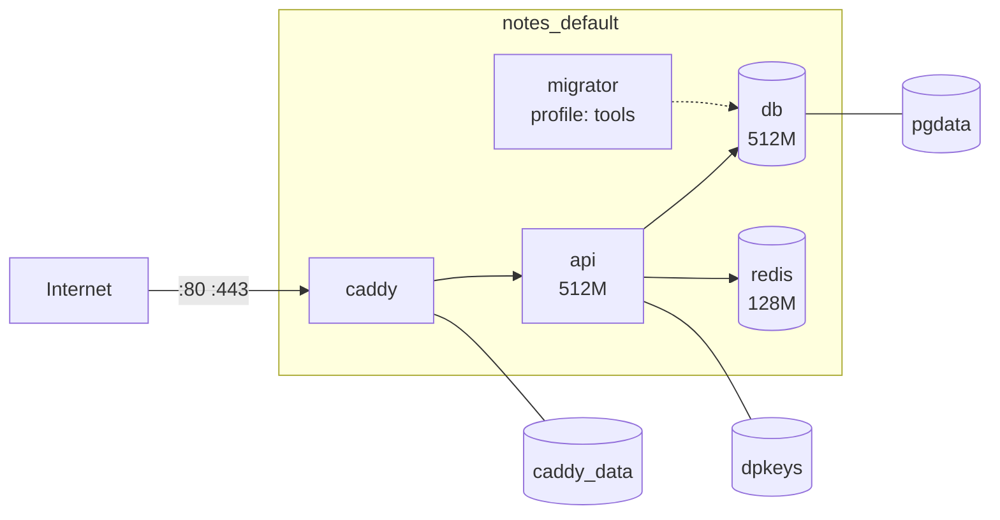

# compose.prod.yml

> The production file pulls images by tag, exposes only Caddy, and gives every service limits, logs, and restarts.

## Problem
Every production concern — secrets, logs, limits, restarts, TLS — has to land somewhere concrete. Here is where.



## Example — [compose.prod.yml](../../examples/02-dotnet-api/compose.prod.yml) (excerpt)
```yaml
api:
  image: ${REGISTRY:?}/notes-api:${IMAGE_TAG:?set IMAGE_TAG}
  restart: unless-stopped
  environment:
    ConnectionStrings__Redis: redis:6379
    ASPNETCORE_FORWARDEDHEADERS_ENABLED: "true"
  secrets: [{ source: db_connection, target: ConnectionStrings__Db }]
  volumes: ["dpkeys:/app/keys"]
  stop_grace_period: 30s
  deploy: { resources: { limits: { memory: 512M, cpus: "1.0" } } }
  depends_on:
    db: { condition: service_healthy }
    redis: { condition: service_healthy }
  logging: *logging
```

## Line → Reason
| Setting | Reason | Doc |
|---|---|---|
| `image: …:${IMAGE_TAG:?}` | Never build on server; fail if tag unset | [25](../05-compose/25-compose-dev-workflow.md) |
| No `ports:` except Caddy | DB/Redis/API private | [16](../04-data-network/16-networking.md) |
| `secrets:` + `*_FILE` | 0 passwords in `inspect` (measured) | below |
| `dpkeys` volume | Logins survive redeploys | below |
| `stop_grace_period: 30s` | .NET drains requests | [10](../03-containers/10-lifecycle.md) |
| `limits.memory` | Leak can't kill the host | [13](../03-containers/13-limits.md) |
| `logging: local 10m×3` | 400k lines: 44 MB → 480 KB (measured) | — |
| `restart: unless-stopped` | Recover from crashes (not from "unhealthy") | [39](../08-anti-patterns/39-runtime.md) |
| `redis --maxmemory 64mb allkeys-lru` | Cache evicts instead of OOM | — |
| `migrator` in `profiles: [tools]` | Runs only when called | [33](33-ef-migrations.md) |
| No `container_name:` | Allows `--scale api=2` rollout | [35](35-zero-downtime.md) |

## Data Protection Keys
| Without `dpkeys` volume | With it |
|---|---|
| New container = new key ring | Keys persist in `/app/keys` |
| Every deploy: auth cookies & antiforgery tokens invalid → users logged out | Seamless |

## Secrets — files, not env vars
```csharp
// Program.cs: /run/secrets/ConnectionStrings__Db → config key ConnectionStrings:Db
builder.Configuration.AddKeyPerFile("/run/secrets", optional: true);
```
| Leak path (measured) | With file secrets |
|---|---|
| `-e`/`environment:` → shown by `docker inspect` | 0 env vars contain `password` |
| `ARG TOKEN` → shown by `docker history` | Build secrets: `RUN --mount=type=secret` |
| Secret file `chmod 600` owned by `deploy` | api (UID 1654) can't read → `chmod 444` |

## Key Points
- `.env` holds only non-secrets
- `secrets/*.txt` never in git
- Anchors (`&logging`) avoid repetition

## Pitfall
❌ `ports: ["8080:8080"]` on the api "for debugging" → ✅ Bypasses Caddy (no TLS) and blocks `--scale api=2` (port conflict); use `docker compose exec api wget -qO- localhost:8080/health`

---
← [31 .NET Production Dockerfile](31-dotnet-dockerfile.md) · [Next → 33 EF Core Migrations](33-ef-migrations.md)
