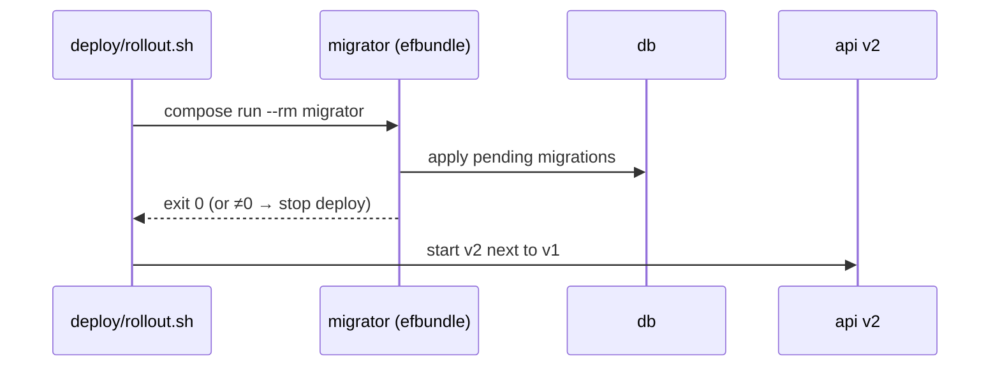
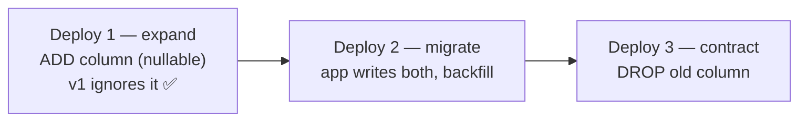

# EF Core Migrations

> Migrations run **once per deploy**, as a separate job, **before** the new app version starts.

## Problem
`Database.Migrate()` at startup: 2 replicas race, a failed migration crash-loops the API, and the app needs DDL rights forever.



## Example
```bash
# create a migration (dev machine)
dotnet ef migrations add AddNoteTags -p src/Api -o Migrations
# deploy runs:
docker compose -f compose.prod.yml run --rm migrator
#   Applying migration '20260928124757_InitialCreate'.
#   Done.
```

## Measured — why the job waits for health
| Migrator start | Result |
|---|---|
| Right after `db` container starts | `Npgsql.NpgsqlException: Failed to connect to 172.20.0.2:5432` ❌ |
| `depends_on: db: service_healthy` | Applied, `Exited (0)` ✅ |

## Bundle vs Alternatives
| Method | Needs SDK in prod | Idempotent | Verdict |
|---|---|---|---|
| `Database.Migrate()` in `Program.cs` | ❌ | ✅ | ❌ races, crash-loops |
| `dotnet ef database update` | ✅ SDK | ✅ | ❌ SDK on server |
| SQL script (`migrations script --idempotent`) | ❌ | ✅ | ✅ DBA review |
| **`efbundle`** (this repo, 148 MB image) | ❌ | ✅ | ✅ |

## Zero-downtime Rule: Expand → Contract

During a rollout **v1 and v2 run together** ([35](35-zero-downtime.md)) → the schema must work for both.

| ❌ Breaks running v1 | ✅ Safe |
|---|---|
| `RENAME COLUMN` | Add new, copy, drop later |
| `DROP COLUMN` still read by v1 | Drop one release later |
| `NOT NULL` without default | Nullable or with default |

## Key Points
- Migrator exits ≠ 0 → deploy stops
- Old migrator on rollback = no-op
- EF doesn't roll schemas back for you

## Pitfall
❌ Rolling back the app after a destructive migration → ✅ The old version meets the new schema; only expand/contract makes rollback safe ([36](36-rollback.md))

---
← [32 compose.prod.yml](32-compose-prod.md) · [Next → 34 CI/CD](34-cicd.md)
