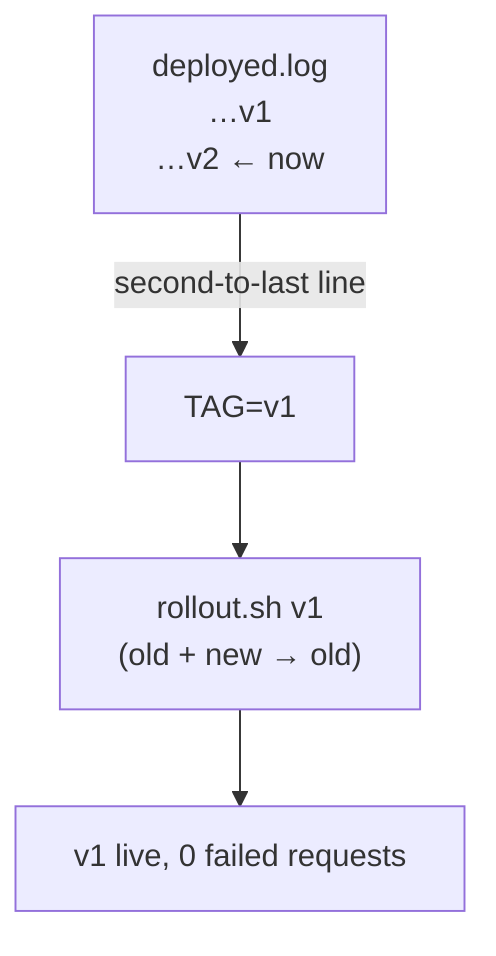

# Rollback

> Rollback = zero-downtime rollout of the **previous image tag**. Possible only because tags are immutable SHAs.

## Problem
v2 is live and returns errors; you need v1 back in seconds, without guessing what "previous" was.



## Example — [rollback.sh](../../examples/02-dotnet-api/rollback.sh)
```bash
./rollback.sh                 # previous tag from deployed.log
./rollback.sh sha-3f2a1bc     # or an exact one
```
```
$ cat deployed.log
2026-09-28T17:44:46Z v1
2026-09-28T17:45:50Z v2
$ ./rollback.sh
↩️  rolling back to v1
✅ rolled out v1 with zero downtime
```

## Measured — requests every 100 ms during rollback
| Metric | Value |
|---|---|
| Failed requests | **0 / 61** |
| Versions served | v2 → v1 |
| Duration | 50 s (incl. migrator no-op + health wait) |

## What Rolls Back — and What Doesn't
| Thing | Rolls back? |
|---|---|
| App code (image) | ✅ |
| Config baked in image | ✅ |
| DB schema | ❌ → expand/contract ([33](33-ef-migrations.md)) |
| DB data written by v2 | ❌ |
| `.env` / `secrets/` edits | ❌ → keep them in git (encrypted) |

## Why It Works
| Requirement | Where |
|---|---|
| Tag = commit SHA, never overwritten | [26](../06-modern-tools/26-github-actions-ghcr.md) |
| Old images still on server / in registry | `image prune --filter until=168h` keeps 7 days |
| Zero-downtime mechanism | [35](35-zero-downtime.md) |

## Key Points
- Rollback is just another deploy
- Practise it before you need it
- Fix forward if the schema changed destructively

## Pitfall
❌ `docker compose up -d` with `IMAGE_TAG=latest` "to go back" → ✅ `latest` is whatever was pushed last — probably the broken version

---
← [35 Zero-downtime Deploy](35-zero-downtime.md) · [Next → 37 Go-live Checklist](37-checklist.md)
