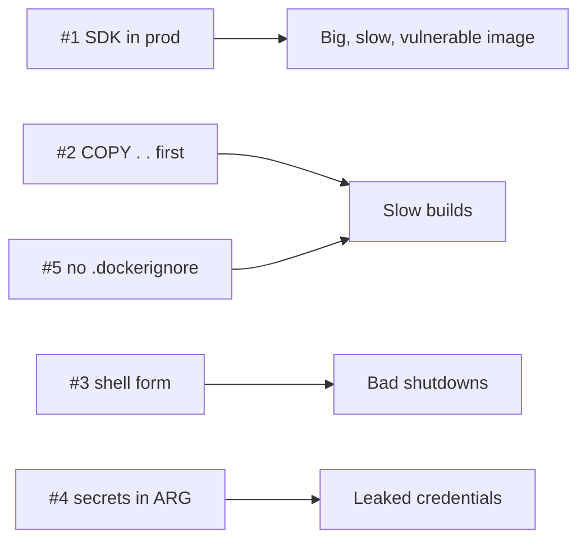

# Anti-patterns #1–5 — Dockerfile

> Mistakes made once in the Dockerfile and paid for on every build and every deploy.



## #1 — SDK Image in Production
```dockerfile
FROM mcr.microsoft.com/dotnet/sdk:10.0          # ❌ final stage
```
**Evidence:** 953 MB and 41 CVEs vs 123 MB and 0 CVEs ([08](../02-images/08-multi-stage.md), [28](../06-modern-tools/28-trivy.md)).
**Fix:** multi-stage, final `FROM …/aspnet:10.0-alpine`.

## #2 — `COPY . .` Before Restore
```dockerfile
COPY . .                                         # ❌ any edit invalidates restore
RUN dotnet publish …
```
**Evidence:** rebuild 107–137 s vs 19–45 s with 3 packages ([07](../02-images/07-layers-cache.md)).
**Fix:** `COPY *.csproj` → `restore` → `COPY . .` → `publish --no-restore`.

## #3 — Shell-form `ENTRYPOINT`
```dockerfile
ENTRYPOINT dotnet Api.dll                        # ❌ PID 1 = /bin/sh on Ubuntu
```
**Evidence:** `docker stop -t 10` → 10.8 s, exit 137 vs 1.1 s, exit 0 ([10](../03-containers/10-lifecycle.md)).
**Fix:** `ENTRYPOINT ["dotnet", "Api.dll"]`.

## #4 — Secrets in `ARG` / `ENV`
```dockerfile
ARG NUGET_TOKEN                                  # ❌
```
**Evidence:** `docker history --no-trunc` → `NUGET_TOKEN=ghp_SuperSecret123` ([32](../07-dotnet-vps/32-compose-prod.md)).
**Fix:** `RUN --mount=type=secret,id=nuget …` at build, `/run/secrets` at runtime.

## #5 — No `.dockerignore`
```
COPY . .   # ❌ copies host bin/ obj/ .git/ .env
```
**Evidence:** context 631 kB vs 1.96 kB **and** `error MSB4018 … fallback package folder 'C:\…'` ([09](../02-images/09-dockerignore.md)).
**Fix:** `.dockerignore` with `**/bin`, `**/obj`, `.git`, `.env`.

## Key Points
- All five are one-line fixes
- Review every Dockerfile against them

---
← [37 Go-live Checklist](../07-dotnet-vps/37-checklist.md) · [Next → 39 Anti-patterns #6–10](39-runtime.md)
