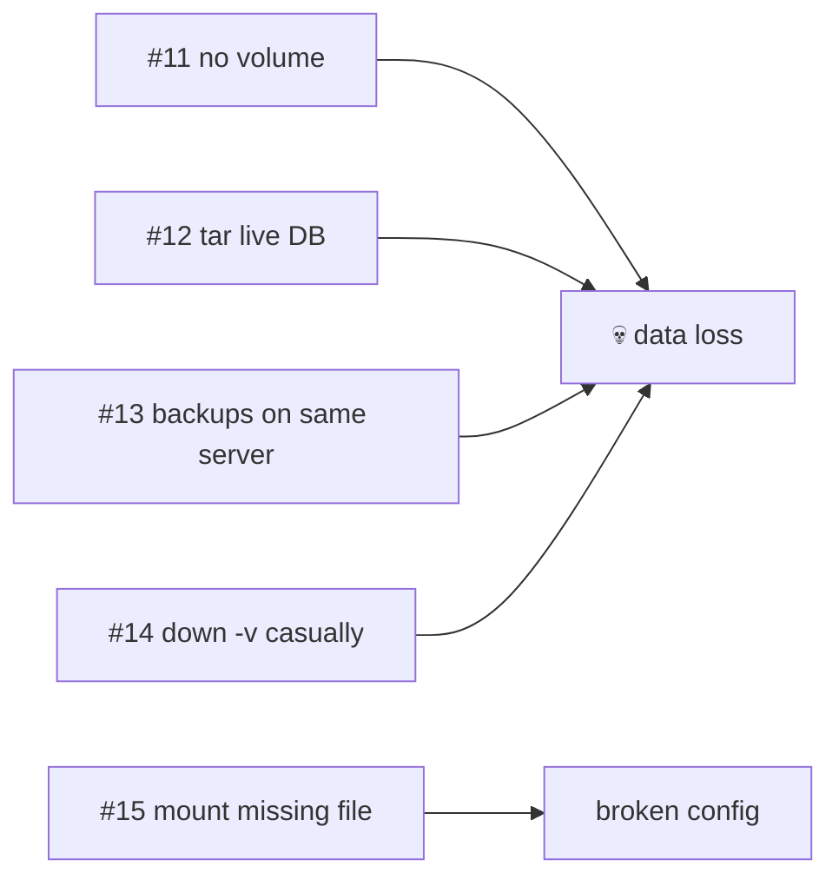

# Anti-patterns #11–15 — Data

> Containers are disposable; data is not. These five lose it.



## #11 — Database Without a Named Volume
```bash
docker run -d postgres:17-alpine                 # ❌
```
**Evidence:** 1000 rows → `rm` + `run` → `relation "t" does not exist`; 2 runs left 2 anonymous volumes (80 MB) ([14](../04-data-network/14-volumes.md)).
**Fix:** `-v pgdata:/var/lib/postgresql/data`.

## #12 — `tar` of a Live Database Volume
```bash
docker run --rm -v pgdata:/data alpine tar czf /b/db.tgz /data   # ❌ while db runs
```
**Evidence:** 5.9 MB vs 211 KB with `pg_dump` for 100k rows — and a tar of running files can be inconsistent ([14](../04-data-network/14-volumes.md)).
**Fix:** `pg_dump | gzip`.

## #13 — Backups Only on the Same Server
```
~/notes/backups/*.sql.gz   # ❌ only copy
```
**Evidence:** restore drill works (50/50 rows) — **if** the file still exists ([backup.sh](../../examples/02-dotnet-api/backup.sh)).
**Fix:** `rclone copy` to another provider; test restores monthly.

## #14 — `down -v` / `prune --volumes` as a Habit
```bash
docker compose down -v                           # ❌ on prod
docker system prune -a --volumes                 # ❌
```
**Evidence:** `down` → `up` kept 3 notes; `down -v` → empty DB ([20](../05-compose/20-multi-service-app.md)).
**Fix:** plain `down` / `prune`; never `-v` outside local dev.

## #15 — Bind-mounting a File That Doesn't Exist
```bash
-v ./appsettings.Production.json:/app/appsettings.Production.json   # ❌ typo in host path
```
**Evidence:** Docker created an empty **directory** with that name on the host and in the container ([15](../04-data-network/15-bind-mounts.md)).
**Fix:** check `ls -l` first; prefer config via env / secrets.

## Key Points
- Name every data volume
- Dump, ship off-site, restore-test
- `-v` flags on `down`/`prune` delete data

---
← [39 Anti-patterns #6–10](39-runtime.md) · [Next → 41 Anti-patterns #16–20](41-network-security.md)
