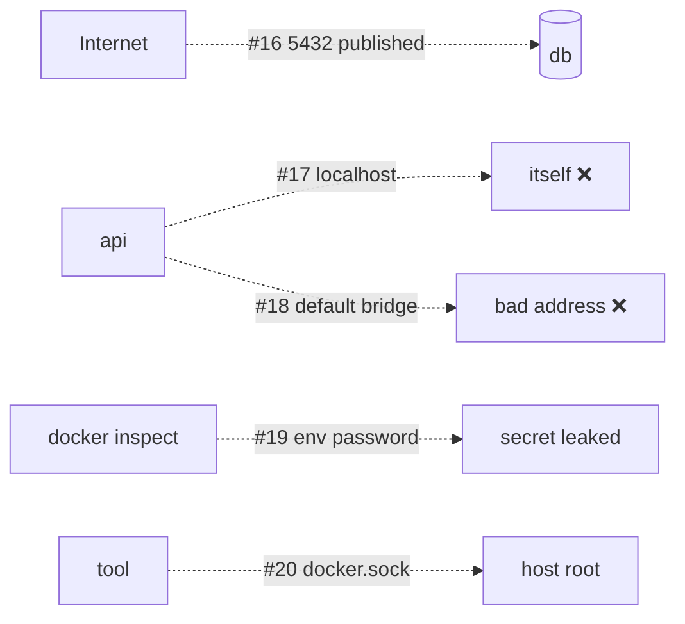

# Anti-patterns #16–20 — Network & Security

> Reachability mistakes: things exposed that shouldn't be, or unreachable that should be.



## #16 — Publishing Database Ports
```yaml
db:
  ports: ["5432:5432"]                            # ❌
```
**Evidence (documented Docker behaviour — not reproducible on Docker Desktop):** Docker inserts iptables rules ahead of ufw → reachable despite `ufw deny` ([16](../04-data-network/16-networking.md), [30](../07-dotnet-vps/30-vps-setup.md)).
**Fix:** no `ports:`; dev only `127.0.0.1:5432:5432`.

## #17 — `localhost` in Connection Strings
```
Host=localhost;Database=notes                    # ❌
```
**Evidence:** inside a container `localhost` = itself → `Connection refused` ([17](../04-data-network/17-dns.md)).
**Fix:** `Host=db` (service name).

## #18 — Using the Default Bridge Network
```bash
docker run -d --name api my-api                  # ❌ default bridge
```
**Evidence:** `wget http://n1:8080` → `bad address`; on a user-defined network → 200 ([16](../04-data-network/16-networking.md)).
**Fix:** `docker network create backend` (Compose does it automatically).

## #19 — Passwords as Environment Variables
```yaml
environment:
  ConnectionStrings__Db: Host=db;Password=S3cret   # ❌
```
**Evidence:** `docker inspect` prints every env var; with file secrets → 0 env vars contain `password` ([32](../07-dotnet-vps/32-compose-prod.md)).
**Fix:** Compose `secrets:` + `AddKeyPerFile("/run/secrets")`, `POSTGRES_PASSWORD_FILE`.

## #20 — Mounting `docker.sock` Casually
```yaml
volumes: ["/var/run/docker.sock:/var/run/docker.sock"]   # ❌ "the README said so"
```
**Evidence:** autoheal used it to restart containers every ~6 s — the same access can start a privileged container on the host ([03](../01-foundations/03-architecture.md)).
**Fix:** only trusted, pinned images; `:ro` where possible; never on public-facing UIs without auth.

## Key Points
- Only the proxy publishes ports
- Names over IPs over `localhost`
- Secrets as files

---
← [40 Anti-patterns #11–15](40-data.md) · [Next → 42 Anti-patterns #21–25](42-deploy-ci.md)
