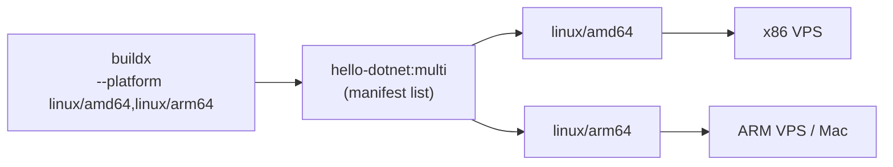

# buildx — Multi-arch Images

> One tag, many CPU architectures: the registry serves amd64 to your VPS and arm64 to a Mac or Graviton server.

## Problem
Image built on an M-series Mac fails on an amd64 VPS with `exec format error` — and vice versa.



## Example — [Dockerfile.multiarch](../../examples/01-hello-dotnet/Dockerfile.multiarch)
```dockerfile
# SDK runs natively on the build machine and cross-compiles → no slow CPU emulation
FROM --platform=$BUILDPLATFORM mcr.microsoft.com/dotnet/sdk:10.0-alpine AS build
ARG TARGETARCH
COPY HelloApi.csproj .
RUN dotnet restore -a $TARGETARCH
COPY . .
RUN dotnet publish -c Release -a $TARGETARCH --no-restore -o /app

FROM mcr.microsoft.com/dotnet/aspnet:10.0-alpine      # pulled per target platform
COPY --from=build /app .
```
```bash
docker buildx build --platform linux/amd64,linux/arm64 -f Dockerfile.multiarch -t hello-dotnet:multi .
```

## Measured
```
docker image ls --tree hello-dotnet:multi
hello-dotnet:multi   229MB
├─ linux/amd64       177MB
└─ linux/arm64       51.9MB
docker run --rm --platform linux/arm64 --entrypoint uname hello-dotnet:multi -m
aarch64 ✅
```
Build time for both: 571 s on a loaded 4-CPU laptop, most of it pulling the arm64 base image.

## Emulation vs Cross-compile
| Approach | How | Speed for .NET |
|---|---|---|
| QEMU emulation | Whole build runs as arm64 | Slow, sometimes flaky |
| `$BUILDPLATFORM` + `-a $TARGETARCH` | Native SDK, cross-compile | Near native ✅ |

## Built-in Build Args
| Arg | Example value |
|---|---|
| `BUILDPLATFORM` | `linux/amd64` (the machine building) |
| `TARGETPLATFORM` | `linux/arm64` |
| `TARGETARCH` | `arm64` → `dotnet -a arm64` |

## Key Points
- Multi-arch = one manifest list
- Cross-compile .NET, don't emulate
- CI: `docker/setup-buildx-action` ([35](35-ghcr-actions.md))

## Pitfall
❌ `RUN apk add …` in the final stage of a multi-arch build → ✅ That step runs under emulation for arm64; keep final stages to `COPY` when possible

---
← [Phase 7](../07-deployment/README.md) · [Next → 35 GHCR + Actions](35-ghcr-actions.md)
