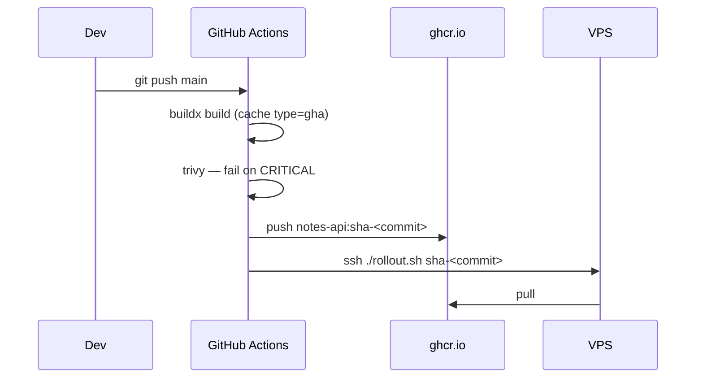

# GHCR + GitHub Actions

> Every push to `main` → build → scan → push `sha-<commit>` to GHCR → deploy.

## Problem
Building on a laptop or on the server is unrepeatable and slow; you want one pipeline that produces tested, tagged images.



## Example — [.github/workflows/deploy.yml](../../examples/02-dotnet-api/.github/workflows/deploy.yml)
```yaml
permissions: { contents: read, packages: write }     # GITHUB_TOKEN may push to GHCR
env:
  REGISTRY: ghcr.io/${{ github.repository_owner }}
  TAG: sha-${{ github.sha }}
jobs:
  build:
    steps:
      - uses: docker/build-push-action@v6
        with:
          target: runtime
          load: true
          tags: ${{ env.REGISTRY }}/notes-api:${{ env.TAG }}
          cache-from: type=gha,scope=api
          cache-to: type=gha,mode=max,scope=api
      - run: docker run … aquasec/trivy image --severity CRITICAL --ignore-unfixed --exit-code 1 …
      - run: docker push …
  deploy:
    needs: build
    environment: production
    concurrency: production
```
Validated with `actionlint` ✅ (not executed here — needs your repo + VPS secrets).

## Secrets to Create
| Secret | Value |
|---|---|
| `VPS_HOST` | Server IP |
| `VPS_SSH_KEY` | Private key of `deploy` user |
| `VPS_KNOWN_HOSTS` | `ssh-keyscan -H <host>` output |
| *(built-in)* `GITHUB_TOKEN` | Pushes to GHCR |

## On the Server, Once
```bash
echo "$PAT_READ_PACKAGES" | docker login ghcr.io -u <user> --password-stdin
```

## Key Points
- Tag = commit SHA
- Scan **before** push
- `concurrency` → no overlapping deploys
- `environment` → optional manual approval

## Pitfall
❌ `ssh-keyscan` inside the workflow → ✅ Trusts whatever answers (MITM); store the known host key as a secret

---
← [34 buildx](34-buildx.md) · [Next → 36 Proxies](36-proxies.md)
