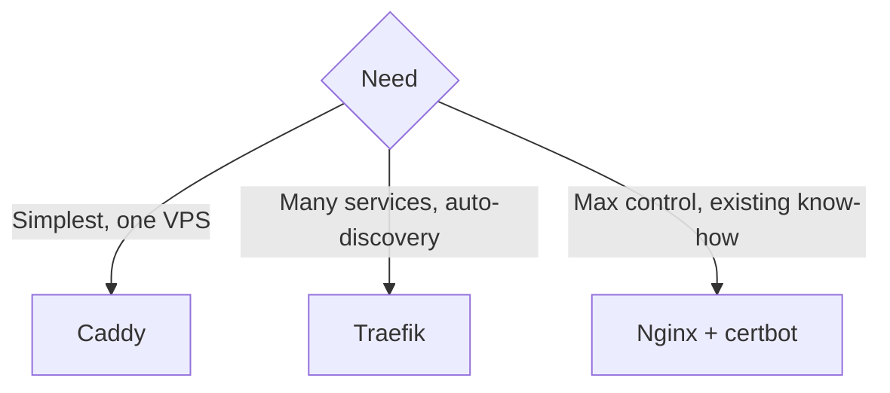

# Traefik vs Caddy vs Nginx

> Same job — HTTPS for `notes.example.com` → `api:8080` — three very different configs.

## Problem
Every stack needs a reverse proxy ([27](../07-deployment/27-reverse-proxy.md)); picking one by habit costs you certificates plumbing or config sprawl.



## Caddy — 5 lines ([used in this repo](../../examples/02-dotnet-api/Caddyfile))
```
notes.example.com {
	reverse_proxy api:8080
}
```

## Traefik — labels on each service
```yaml
traefik:
  image: traefik:v3.5
  command:
    - --providers.docker.exposedbydefault=false
    - --entrypoints.web.address=:80
    - --entrypoints.web.http.redirections.entrypoint.to=websecure
    - --entrypoints.websecure.address=:443
    - --certificatesresolvers.le.acme.tlschallenge=true
    - --certificatesresolvers.le.acme.email=you@example.com
    - --certificatesresolvers.le.acme.storage=/letsencrypt/acme.json
  ports: ["80:80", "443:443"]
  volumes: ["/var/run/docker.sock:/var/run/docker.sock:ro", "letsencrypt:/letsencrypt"]
api:
  labels:
    - traefik.enable=true
    - traefik.http.routers.api.rule=Host(`notes.example.com`)
    - traefik.http.routers.api.tls.certresolver=le
    - traefik.http.services.api.loadbalancer.server.port=8080
```

## Nginx — config + separate certbot
```nginx
server {
    listen 443 ssl;
    server_name notes.example.com;
    ssl_certificate     /etc/letsencrypt/live/notes.example.com/fullchain.pem;
    ssl_certificate_key /etc/letsencrypt/live/notes.example.com/privkey.pem;
    location / {
        proxy_pass http://api:8080;
        proxy_set_header Host $host;
        proxy_set_header X-Forwarded-Proto $scheme;
        proxy_set_header X-Forwarded-For $proxy_add_x_forwarded_for;
    }
}
# + a :80 server block for the redirect and ACME challenge, + certbot renew cron
```

## Comparison
| | Caddy | Traefik | Nginx |
|---|---|---|---|
| Auto HTTPS | ✅ | ✅ | ❌ certbot |
| New service = | Edit Caddyfile | Add labels | Edit conf + reload |
| Needs `docker.sock` | ❌ | ✅ (read-only) | ❌ |
| Lines for this example | ~5 | ~15 | ~15 + certbot |
| Sweet spot | 1 VPS, few apps | Many containers | High-traffic tuning |

## Key Points
- Caddy: default for this repo
- Traefik: shines with many services
- Nginx: power, more plumbing

## Pitfall
❌ Traefik with `exposedbydefault=true` → ✅ Every container (DB admin UIs too) gets routed; expose explicitly

---
← [35 GHCR + Actions](35-ghcr-actions.md) · [Next → 37 Self-hosted PaaS](37-self-hosted-paas.md)
