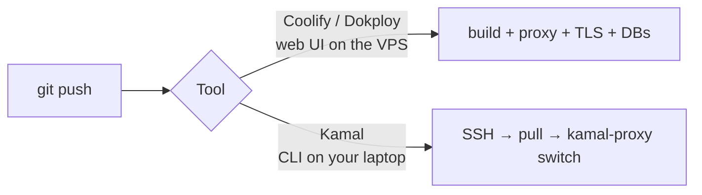

# Coolify / Dokploy / Kamal

> Heroku-style "git push → deployed" on your own VPS, built on Docker.

## Problem
Phases 7 and 9 wire proxy, TLS, deploys, and rollbacks by hand. These tools package all of it.



## Comparison
| | Coolify | Dokploy | Kamal |
|---|---|---|---|
| Interface | Web UI | Web UI | CLI + `deploy.yml` |
| Runs on VPS | Its own containers (~1 GB RAM typical) | Its own containers | Only your app + `kamal-proxy` |
| Proxy / TLS | Traefik or Caddy, auto | Traefik, auto | kamal-proxy, auto |
| Zero-downtime | ✅ | ✅ | ✅ |
| Databases | One-click | One-click | "accessories" |
| Multi-server | ✅ | ✅ (Swarm) | ✅ |
| Best for | UI lovers, many small apps | Same, lighter | Devs who like config-as-code |

## Kamal — whole config for this API
```yaml
# config/deploy.yml
service: notes
image: you/notes-api
servers:
  web: [203.0.113.10]
proxy:
  host: notes.example.com
  ssl: true
  app_port: 8080
  healthcheck: { path: /health }
registry:
  server: ghcr.io
  username: you
  password: [KAMAL_REGISTRY_PASSWORD]
accessories:
  db:
    image: postgres:17-alpine
    host: 203.0.113.10
    directories: ["data:/var/lib/postgresql/data"]
```
```bash
kamal setup      # first time: installs Docker, proxy, accessories
kamal deploy     # build, push, zero-downtime switch
kamal rollback <version>
```

## vs This Repo's Scripts
| | Scripts (Phase 9) | PaaS tool |
|---|---|---|
| Understand every moving part | ✅ | ❌ hidden |
| Time to first deploy | Hours | Minutes |
| Extra RAM on VPS | 0 | 0 – 1 GB |

## Key Points
- Learn the manual way once
- Then a tool saves hours
- Kamal = closest to this repo's approach

## Pitfall
❌ Coolify/Dokploy dashboard on a public port with a weak password → ✅ It controls every container on the host; strong auth + 2FA, or SSH tunnel only

---
← [36 Proxies](36-proxies.md) · [Next → 38 Image Scanning](38-image-scanning.md)
