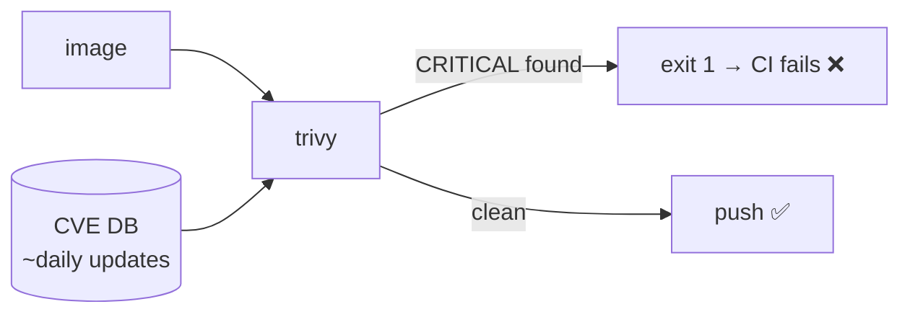

# Trivy / Docker Scout — Image Scanning

> Scanners match every OS package and NuGet dependency in the image against CVE databases.

## Problem
Your code is fine, but the base image ships an OpenSSL with a known CVE — and nobody checks until an audit.



## Example
```bash
docker run --rm -v /var/run/docker.sock:/var/run/docker.sock aquasec/trivy \
  image --scanners vuln --severity HIGH,CRITICAL --ignore-unfixed --exit-code 1 notes-api:v1
```

## Measured — 2026-09-28
| Image | Findings |
|---|---|
| `hello-dotnet:naive` (`sdk:10.0`, Ubuntu) | 41 (5 LOW, 36 MEDIUM) |
| `aspnet:10.0` (Ubuntu) | 14 |
| `aspnet:10.0-noble-chiseled` | 8 |
| `aspnet:10.0-alpine` apps (incl. Npgsql, StackExchange.Redis) | **0** |
Full table + hardening: [22](../06-production-basics/22-security.md).

## What It Scans
| Layer | Example target |
|---|---|
| OS packages | `alpine 3.24.2`, `ubuntu 24.04` |
| .NET deps | `app/Api.deps.json` (every NuGet package) |
| Runtime | `Microsoft.AspNetCore.App.deps.json` |

## Trivy vs Scout
| | Trivy | Docker Scout |
|---|---|---|
| Cost | Free, open source | Free tier, Docker login |
| Run | `trivy image …` | `docker scout cves img` |
| Extras | Secrets, IaC, SBOM | Base-image upgrade advice |

## Key Points
- Scan before push, in CI
- `--ignore-unfixed` → only actionable findings
- Rebuild weekly to pick up patched bases

## Pitfall
❌ Scanner errors treated as "no findings" → ✅ Measured: a DB download **timeout** made a wrapper script print "0 vulnerabilities" for all 5 images; real count was 41 for one. Let the scanner's own exit code fail the job

---
← [37 Self-hosted PaaS](37-self-hosted-paas.md) · [Next → 39 Portainer](39-portainer.md)
