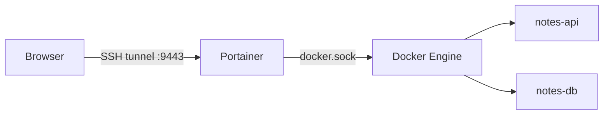

# Portainer

> A web UI for containers, images, volumes, networks, and Compose stacks — on one or many hosts.

## Problem
Teammates who don't live in a terminal still need to see logs, restart a service, or check disk usage.



## Example
```bash
docker volume create portainer_data
docker run -d --name portainer --restart unless-stopped \
  -p 127.0.0.1:9443:9443 \
  -v /var/run/docker.sock:/var/run/docker.sock \
  -v portainer_data:/data \
  portainer/portainer-ce:lts
# laptop:
ssh -L 9443:localhost:9443 deploy@your-vps   → https://localhost:9443
```

## What You Get
| Feature | CLI equivalent |
|---|---|
| Container list + status | `docker ps -a` |
| Logs viewer | `docker logs -f` |
| Console | `docker exec -it … sh` |
| Stats graphs | `docker stats` |
| Stacks (Compose) | `docker compose up/down` |
| Multi-host | Portainer Agent on each host |

## When to Use
| ✅ Good | ❌ Not a replacement for |
|---|---|
| Visibility for the team | CI/CD deploys ([35](35-ghcr-actions.md)) |
| Quick log look on a phone | Monitoring + alerts ([31](../07-deployment/31-monitoring.md)) |

## Key Points
- `lts` tag for stability
- Bind to `127.0.0.1` + tunnel
- Create admin within 5 min (setup timeout)

## Pitfall
❌ `-p 9443:9443` on a public VPS → ✅ Portainer holds `docker.sock` = root on the host; one weak password = server takeover

---
← [38 Image Scanning](38-image-scanning.md) · [Next → 40 Dev & Test](40-dev-test.md)
