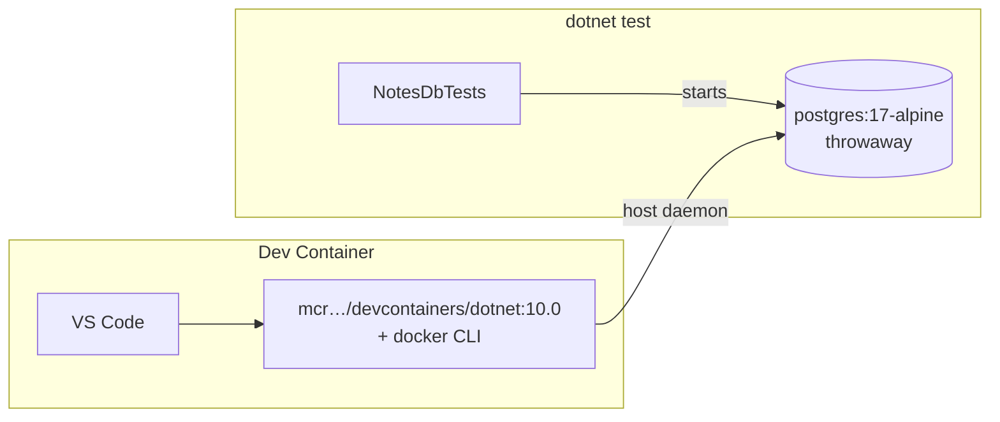

# Dev Containers & Testcontainers

> Dev Containers: the **dev environment** is an image. Testcontainers: **integration tests** start real dependencies in containers.

## Problem
"Install .NET 10, dotnet-ef, Postgres 17…" onboarding docs rot; tests against mocks or a shared DB miss real bugs.



## Dev Container — [.devcontainer/devcontainer.json](../../examples/02-dotnet-api/.devcontainer/devcontainer.json)
```json
{
  "image": "mcr.microsoft.com/devcontainers/dotnet:10.0",
  "features": { "ghcr.io/devcontainers/features/docker-outside-of-docker:1": {} },
  "forwardPorts": [8080],
  "postCreateCommand": "dotnet tool restore && dotnet restore src/Api"
}
```
VS Code → **Reopen in Container** → identical toolchain for every developer.

## Testcontainers — [tests/Api.Tests](../../examples/02-dotnet-api/tests/Api.Tests/NotesDbTests.cs)
```csharp
public class NotesDbTests : IAsyncLifetime
{
    private readonly PostgreSqlContainer _postgres =
        new PostgreSqlBuilder("postgres:17-alpine").Build();

    public Task InitializeAsync() => _postgres.StartAsync();
    public Task DisposeAsync() => _postgres.DisposeAsync().AsTask();

    [Fact]
    public async Task Migrations_apply_and_notes_round_trip()
    {
        var opts = new DbContextOptionsBuilder<AppDb>().UseNpgsql(_postgres.GetConnectionString()).Options;
        await using var db = new AppDb(opts);
        await db.Database.MigrateAsync();           // same migrations the migrator runs
        …
    }
}
```

## Measured
```
cd examples/02-dotnet-api/tests/Api.Tests && dotnet test
Passed!  - Failed: 0, Passed: 1 — Duration: 57 s (first run, pulls images) / 40 s (warm)
```
Testcontainers.PostgreSql 4.15.0 · xunit 2.9.3 · on a loaded laptop.

## Mocks vs Testcontainers
| | In-memory / mocks | Testcontainers |
|---|---|---|
| Real SQL + migrations | ❌ | ✅ |
| Speed | ms | seconds |
| Needs Docker | ❌ | ✅ (CI runners have it) |

## Key Points
- One container per test class
- Same image tag as production
- Auto-cleaned (Ryuk sidecar)

## Pitfall
❌ EF Core versions drift between projects → ✅ Measured `CS1705` (10.0.12 vs 10.0.4); pin `Microsoft.EntityFrameworkCore` explicitly in the API

---
← [39 Portainer](39-portainer.md) · [Next → 41 Podman](41-podman.md)
