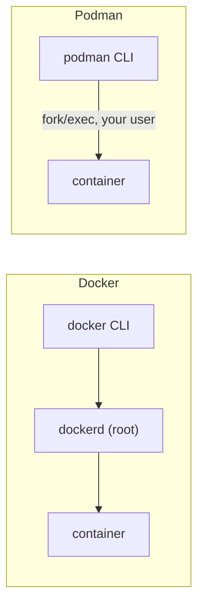

# Podman

> A Docker-compatible engine with **no daemon** and **rootless** by default — same images, same commands.

## Problem
Docker's daemon runs as root and `docker` group = root; some environments (RHEL, strict security) forbid that.



## Example
```bash
podman run -d -p 8080:8080 ghcr.io/you/notes-api:sha-3f2a1bc
alias docker=podman            # most commands work unchanged
podman compose up -d           # runs compose.yml via a compose provider
podman generate kube notes-api > notes.yaml   # → Kubernetes YAML
```

## Docker vs Podman
| | Docker | Podman |
|---|---|---|
| Daemon | `dockerd`, always running | None |
| Default user | root daemon | Rootless |
| Image format | OCI | OCI (same images) |
| Compose | Built-in v2 | `podman compose` wrapper |
| Pods | ❌ | ✅ (K8s-style) |
| systemd integration | Restart policies | Quadlet units |
| Desktop app | Docker Desktop | Podman Desktop (free) |

## When to Pick It
| ✅ Podman | ✅ Docker |
|---|---|
| RHEL / Fedora servers | Widest docs + tooling |
| Rootless requirement | Compose-heavy workflows |
| No Desktop licence budget | Docker Desktop features |

## Key Points
- Same OCI images
- Rootless = smaller blast radius
- Rootless: ports < 1024 need extra config

## Pitfall
❌ Assuming every Compose feature works → ✅ Test your `compose.yml`; health-conditioned `depends_on` and some networking differ by provider

---
← [40 Dev & Test](40-dev-test.md) · [Next phase → 09 .NET → VPS](../09-dotnet-vps/README.md)
