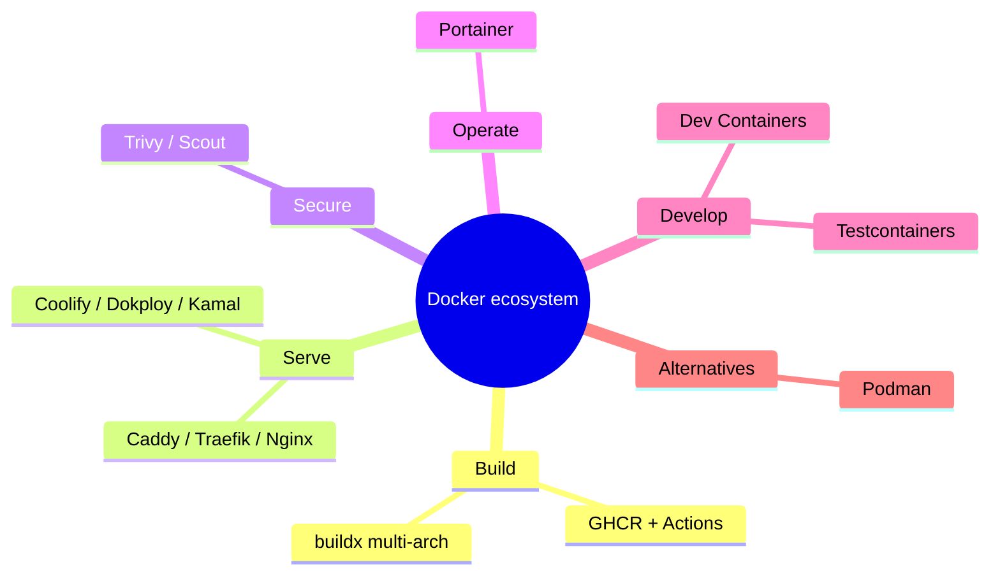

# Phase 8 — Modern Tools

> The ecosystem around Docker in 2026: what each tool is for, and when to reach for it.

| # | Idea | One line | File |
|---|---|---|---|
| 34 | buildx | One tag for amd64 + arm64 | [34](34-buildx.md) |
| 35 | GHCR + GitHub Actions | Build, scan, push, deploy on every commit | [35](35-ghcr-actions.md) |
| 36 | Traefik vs Caddy vs Nginx | Same routing, three configs | [36](36-proxies.md) |
| 37 | Coolify / Dokploy / Kamal | Heroku-like on your own VPS | [37](37-self-hosted-paas.md) |
| 38 | Trivy / Docker Scout | CVE scanning that can fail the build | [38](38-image-scanning.md) |
| 39 | Portainer | Web UI for containers | [39](39-portainer.md) |
| 40 | Dev Containers & Testcontainers | Same tools for every dev; real DBs in tests | [40](40-dev-test.md) |
| 41 | Podman | Daemonless, rootless Docker alternative | [41](41-podman.md) |

---
← [Phase 7](../07-deployment/README.md) · [Next phase → 09 .NET → VPS](../09-dotnet-vps/README.md)
