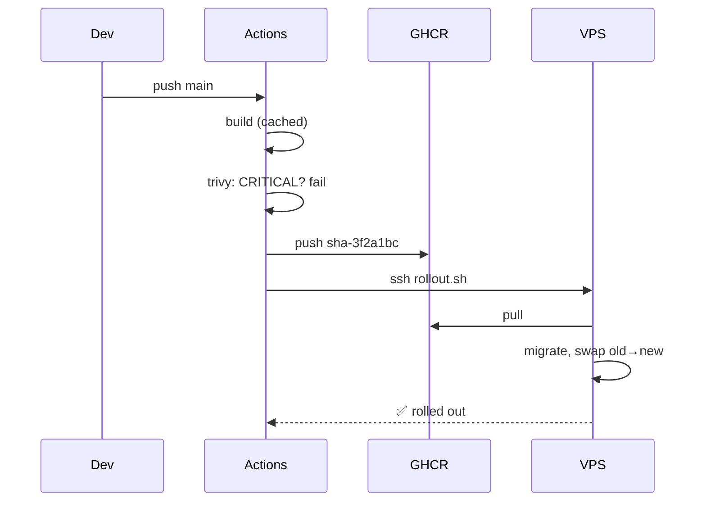

# CI/CD — Push to Deployed

> After one-time setup, `git push` to `main` is the only deploy step.

## Problem
Manual deploys drift ("which tag is live?"), skip scans, and happen from laptops with stale code.



## One-time Setup
| Where | What |
|---|---|
| VPS | [42 VPS setup](42-vps-setup.md), `~/notes` with `compose.prod.yml`, `Caddyfile`, scripts, `.env`, `secrets/` |
| VPS | `docker login ghcr.io` with a `read:packages` PAT |
| VPS | First run: `./deploy.sh sha-<first commit>` |
| DNS | A record → VPS IP (before Caddy starts) |
| GitHub | Copy [.github/workflows/deploy.yml](../../examples/02-dotnet-api/.github/workflows/deploy.yml) to the API repo root |
| GitHub | Secrets `VPS_HOST`, `VPS_SSH_KEY`, `VPS_KNOWN_HOSTS` |
| GitHub | Environment `production` (optional: required reviewers) |

## Every Deploy
```bash
git commit -am "Add tags to notes" && git push
# Actions: build 2–5 min (cached) → scan → push → rollout
curl https://notes.example.com/     # {"version":"sha-3f2a1bc…"}
```

## Scripts on the Server
| Script | Does | Downtime |
|---|---|---|
| [`deploy.sh`](../../examples/02-dotnet-api/deploy.sh) | pull, migrate, `up -d --wait` | 17.4 s (first deploy / infra changes) |
| [`rollout.sh`](../../examples/02-dotnet-api/rollout.sh) | pull, migrate, scale 2 → 1 | **0 s** (CI uses this) |
| [`rollback.sh`](../../examples/02-dotnet-api/rollback.sh) | rollout of previous tag | 0 s |
| [`backup.sh`](../../examples/02-dotnet-api/backup.sh) | `pg_dump` → gzip → rotate | — |

## Key Points
- CI builds; server only pulls
- `deployed.log` = deploy history
- `concurrency: production` serializes deploys

## Pitfall
❌ CI deploys, but someone edits `compose.prod.yml` on the server by hand → ✅ Keep server files in git too; copy them in the pipeline (`scp`) before `rollout.sh`

---
← [45 EF Migrations](45-ef-migrations.md) · [Next → 47 Rollback](47-rollback.md)
