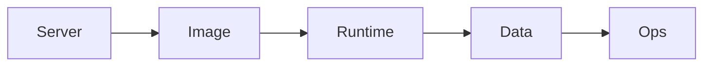

# Go-live Checklist

> 20 checks, each with a command that proves it — run them on the VPS before announcing the URL.

## Problem
"I think we configured that" isn't a check. Each line below has a verifiable result.

## Server
| # | Check | Prove it | Expect |
|---|---|---|---|
| 1 | No password SSH | `sshd -T \| grep passwordauthentication` | `no` |
| 2 | Firewall | `sudo ufw status` | 22, 80, 443 only |
| 3 | Log limits | `docker info -f '{{.LoggingDriver}}'` | `local` |
| 4 | DB not public | `docker port notes-db-1` | *(empty)* |

## Image
| # | Check | Prove it | Expect |
|---|---|---|---|
| 5 | Tag = SHA | `docker compose -f compose.prod.yml images api` | `sha-…` |
| 6 | Non-root | `docker compose exec api id -u` | `1654` |
| 7 | No CRITICAL CVEs | Trivy step green in Actions | exit 0 |
| 8 | No secrets in history | `docker history --no-trunc  \| grep -i -E 'pass\|token'` | *(empty)* |

## Runtime
| # | Check | Prove it | Expect |
|---|---|---|---|
| 9 | HTTPS + redirect | `curl -sI http://<domain>` | `308` → https |
| 10 | Health | `curl -s https://<domain>/health` | `Healthy` |
| 11 | Version visible | `curl -s https://<domain>/` | `"version":"sha-…"` |
| 12 | Limits | `docker stats --no-stream` | `/ 512MiB` for api |
| 13 | Restart policy | `docker inspect -f '{{.HostConfig.RestartPolicy.Name}}' notes-db-1` | `unless-stopped` |
| 14 | Secrets not in env | `docker inspect <api> -f '{{.Config.Env}}' \| grep -ci password` | `0` |

## Data
| # | Check | Prove it | Expect |
|---|---|---|---|
| 15 | Named volumes | `docker volume ls` | `notes_pgdata`, `notes_dpkeys` |
| 16 | Backup cron | `crontab -l` | `backup.sh` daily |
| 17 | Off-site copy | `rclone ls remote:notes-backups` | today's file |
| 18 | Restore drill done | [32](../07-deployment/32-backups.md) | row counts match |

## Ops
| # | Check | Prove it | Expect |
|---|---|---|---|
| 19 | Rollback rehearsed | `./rollback.sh` on staging/local | 0 failed requests |
| 20 | Uptime alert | Stop api briefly | Alert arrives |

## Key Points
- Re-run after infra changes
- Automate 1–15 as a script later
- Items 16–20 are the ones people skip

## Pitfall
❌ Checking only `https://<domain>/` loads → ✅ 18 of these 20 can fail while the homepage still works

---
← [47 Rollback](47-rollback.md) · [Next phase → 10 Anti-patterns](../10-anti-patterns/README.md)
