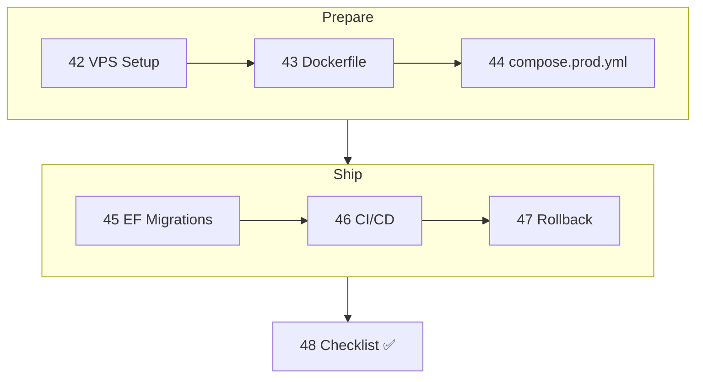

# Phase 9 — .NET API → VPS

> The whole path, end to end, using [examples/02-dotnet-api](../../examples/02-dotnet-api) — rehearsed locally with the same files.

| # | Idea | One line | File |
|---|---|---|---|
| 42 | VPS Setup | User, SSH, firewall, Docker, daemon.json | [42](42-vps-setup.md) |
| 43 | .NET Dockerfile | 3 targets: runtime, migrator, build | [43](43-dotnet-dockerfile.md) |
| 44 | compose.prod.yml | Every production line explained | [44](44-compose-prod.md) |
| 45 | EF Core Migrations | Bundle as a one-shot job | [45](45-ef-migrations.md) |
| 46 | CI/CD | Push → GHCR → rollout, first-time setup | [46](46-cicd.md) |
| 47 | Rollback | Previous SHA, zero downtime | [47](47-rollback.md) |
| 48 | Checklist | 20 checks before go-live | [48](48-checklist.md) |

## Rehearsed Locally — measured
| Step | Result |
|---|---|
| `SKIP_PULL=1 ./deploy.sh v1` | Migrator applied `InitialCreate`, all healthy, 57 s |
| `https://localhost/` via Caddy | `{"version":"v1"}`, HTTP → 308 |
| `./rollout.sh v2` under load | 0 / 67 failed |
| `./rollback.sh` | 0 / 61 failed, back on v1 |
| `./backup.sh` + restore drill | 50 / 50 rows |

---
← [Phase 8](../08-modern-tools/README.md) · [Next phase → 10 Anti-patterns](../10-anti-patterns/README.md)
