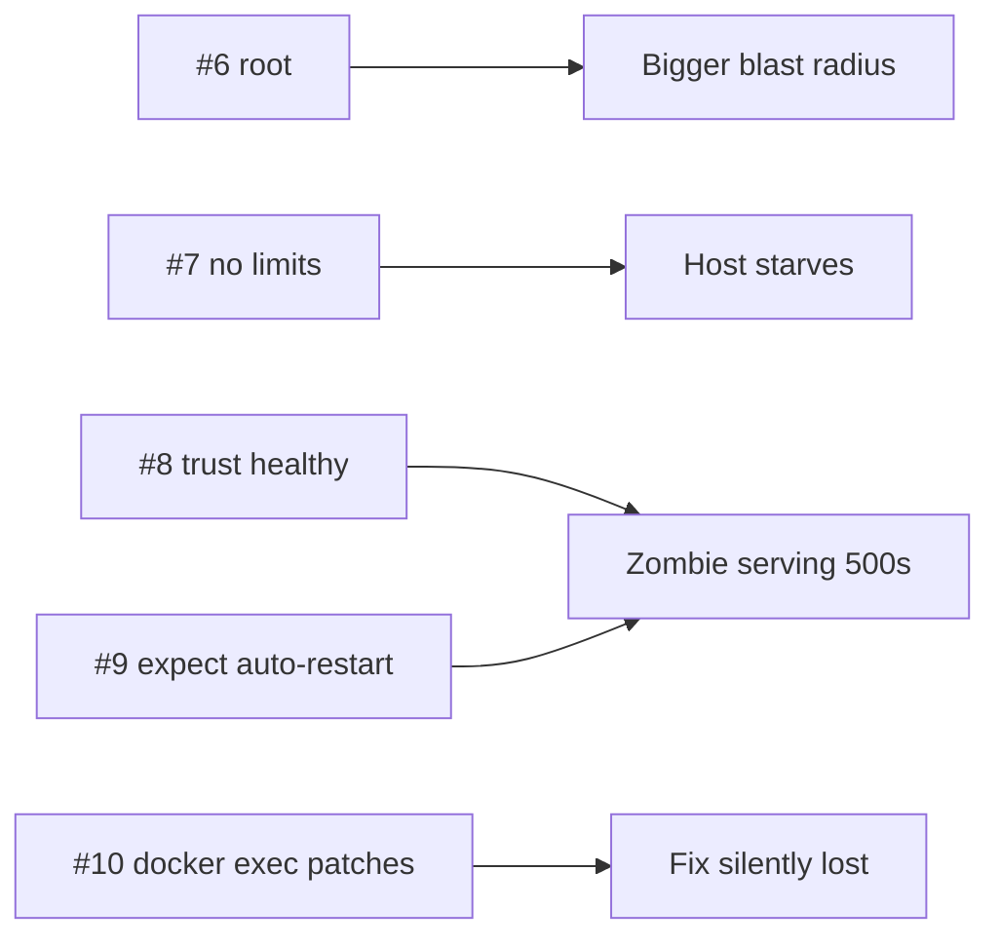

# Anti-patterns #6–10 — Runtime

> The container runs — but with more power, less protection, and less self-healing than you think.



## #6 — Running as Root
```dockerfile
# ❌ no USER line
```
**Evidence:** naive image `id -u` → `0`; root container with `-v /etc:/host-etc` read the host's `shadow` file ([22](../06-production-basics/22-security.md)).
**Fix:** `USER $APP_UID` (1654), `--cap-drop ALL`, `--read-only`.

## #7 — No Memory Limit (or No Swap Cap)
```bash
docker run --memory 256m img                   # ❌ swap doubles it
```
**Evidence:** native leak reached 280 MB and the container kept running ([13](../03-containers/13-limits.md)).
**Fix:** `--memory 256m --memory-swap 256m` (Compose: `deploy.resources.limits`).

## #8 — Trusting "healthy"
```csharp
app.MapHealthChecks("/health");                 // ❌ only proves the process answers
```
**Evidence:** managed leak → `OutOfMemoryException` 500s while `/health` said Healthy for 30+ s ([13](../03-containers/13-limits.md)).
**Fix:** health checks dependencies (DB, Redis), plus error-rate alerts ([31](../07-deployment/31-monitoring.md)).

## #9 — Expecting Docker to Restart Unhealthy Containers
```yaml
restart: unless-stopped                          # ❌ reacts to exits, not to "unhealthy"
```
**Evidence:** failing healthcheck for 12 s → `unhealthy`, `restarts=0` ([28](../07-deployment/28-restart-health.md)).
**Fix:** autoheal (measured: restarted every ~6 s), Swarm, or Kubernetes.

## #10 — Patching Production With `docker exec`
```bash
docker exec api sh -c 'vi /app/appsettings.json'   # ❌
```
**Evidence:** writes land in one container's writable layer; `api-2` didn't see `/tmp/x` ([05](../02-images/05-image-vs-container.md)); the next deploy discards it.
**Fix:** change code/config in git → build → deploy.

## Key Points
- Least privilege by default
- Limits on every service
- "Healthy" ≠ "working"

---
← [49 Dockerfile](49-dockerfile.md) · [Next → 51 Data](51-data.md)
