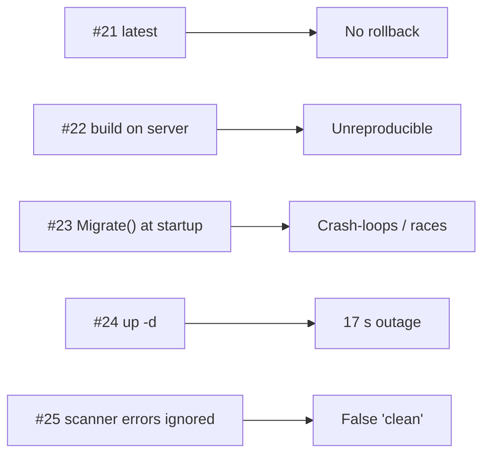

# Anti-patterns #21–25 — Deploy & CI

> The last mile: how a good image still gets deployed badly.



## #21 — Deploying `latest`
```yaml
image: ghcr.io/you/notes-api:latest              # ❌
```
**Evidence:** rollback needs the previous exact tag; `deployed.log` + `sha-…` tags gave a 0-failure rollback ([47](../09-dotnet-vps/47-rollback.md)).
**Fix:** `image: …:${IMAGE_TAG:?}` with `sha-<commit>`.

## #22 — Building on the Server
```bash
ssh vps "cd app && git pull && docker compose up -d --build"   # ❌
```
**Evidence:** cold build of `notes-api` took **4 min 33 s** on a 4-CPU laptop; a VPS also needs the SDK, source, and NuGet access ([46](../09-dotnet-vps/46-cicd.md)).
**Fix:** CI builds + scans + pushes; server only `pull`s.

## #23 — `Database.Migrate()` at Startup
```csharp
db.Database.Migrate();                           // ❌ in Program.cs
```
**Evidence:** migrator started before Postgres was ready → `Failed to connect to 172.20.0.2:5432`; with 2 replicas both would race ([45](../09-dotnet-vps/45-ef-migrations.md)).
**Fix:** `efbundle` migrator job, `depends_on: service_healthy`, run before rollout.

## #24 — Assuming `docker compose up -d` Is Zero-downtime
```bash
IMAGE_TAG=v2 docker compose up -d                # ❌ stops v1 first
```
**Evidence:** 16/50 requests failed, **17.4 s** outage; `rollout.sh` → 0/67 ([29](../07-deployment/29-zero-downtime.md)).
**Fix:** start new → wait healthy → stop old (`rollout.sh`, Kamal, Swarm `start-first`).

## #25 — Treating Scanner Errors as "No Findings"
```bash
trivy image app 2>/dev/null | parse || echo "0 vulnerabilities"   # ❌
```
**Evidence:** Trivy's DB download timed out; the wrapper reported 0 for all 5 images — the real count for one was 41 ([38](../08-modern-tools/38-image-scanning.md)).
**Fix:** let Trivy's own `--exit-code 1` fail the job; never swallow stderr.

## Key Points
- Immutable tags, CI-built images
- Migrate as a job, roll out side by side
- Fail closed on tooling errors

---
← [52 Network & Security](52-network-security.md) · [Back to Phase 10](README.md)
