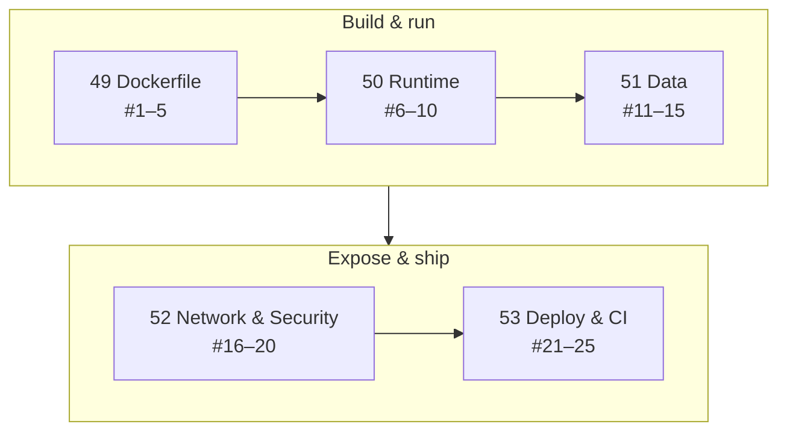

# Phase 10 — 25 Anti-patterns

> The inverse of [24 Best Practices](../06-production-basics/24-best-practices.md): 25 mistakes, each with the **evidence measured in this repo** (one marked as documented behaviour) and the fix.

## All 25 at a Glance
| # | ❌ Anti-pattern | Evidence | File |
|---|---|---|---|
| 1 | SDK image in production | 953 MB, 41 CVEs | [49](49-dockerfile.md) |
| 2 | `COPY . .` before restore | 107–137 s rebuilds | [49](49-dockerfile.md) |
| 3 | Shell-form `ENTRYPOINT` | stop 10.8 s, exit 137 | [49](49-dockerfile.md) |
| 4 | Secrets in `ARG`/`ENV` | token in `docker history` | [49](49-dockerfile.md) |
| 5 | No `.dockerignore` | build fails (MSB4018) | [49](49-dockerfile.md) |
| 6 | Running as root | uid 0, reads host files | [50](50-runtime.md) |
| 7 | No memory limit / swap cap | 280 MB under "256 MB" | [50](50-runtime.md) |
| 8 | Trusting "healthy" | zombie serving 500s | [50](50-runtime.md) |
| 9 | Expecting Docker to restart unhealthy | `restarts=0` | [50](50-runtime.md) |
| 10 | Patching with `docker exec` | lost on next container | [50](50-runtime.md) |
| 11 | Database without a named volume | data gone, 80 MB orphans | [51](51-data.md) |
| 12 | `tar` of a live DB volume | 28× bigger, inconsistent | [51](51-data.md) |
| 13 | Backups on the same server | one failure loses both | [51](51-data.md) |
| 14 | `down -v` / `prune --volumes` casually | deletes data | [51](51-data.md) |
| 15 | Bind-mounting a missing file | becomes a directory | [51](51-data.md) |
| 16 | Publishing DB ports | bypasses ufw | [52](52-network-security.md) |
| 17 | `localhost` in connection strings | `Connection refused` | [52](52-network-security.md) |
| 18 | Default bridge network | `bad address` | [52](52-network-security.md) |
| 19 | Passwords as env vars | visible in `inspect` | [52](52-network-security.md) |
| 20 | Mounting `docker.sock` casually | root on the host | [52](52-network-security.md) |
| 21 | Deploying `latest` | no rollback target | [53](53-deploy-ci.md) |
| 22 | Building on the server | slow, unreproducible | [53](53-deploy-ci.md) |
| 23 | `Migrate()` at startup | race: `Failed to connect` | [53](53-deploy-ci.md) |
| 24 | `up -d` = "zero downtime" | 17.4 s outage | [53](53-deploy-ci.md) |
| 25 | Scanner errors = "clean" | 0 reported, 41 real | [53](53-deploy-ci.md) |

---
← [Phase 9](../09-dotnet-vps/README.md) · [Back to start](../../README.md)
