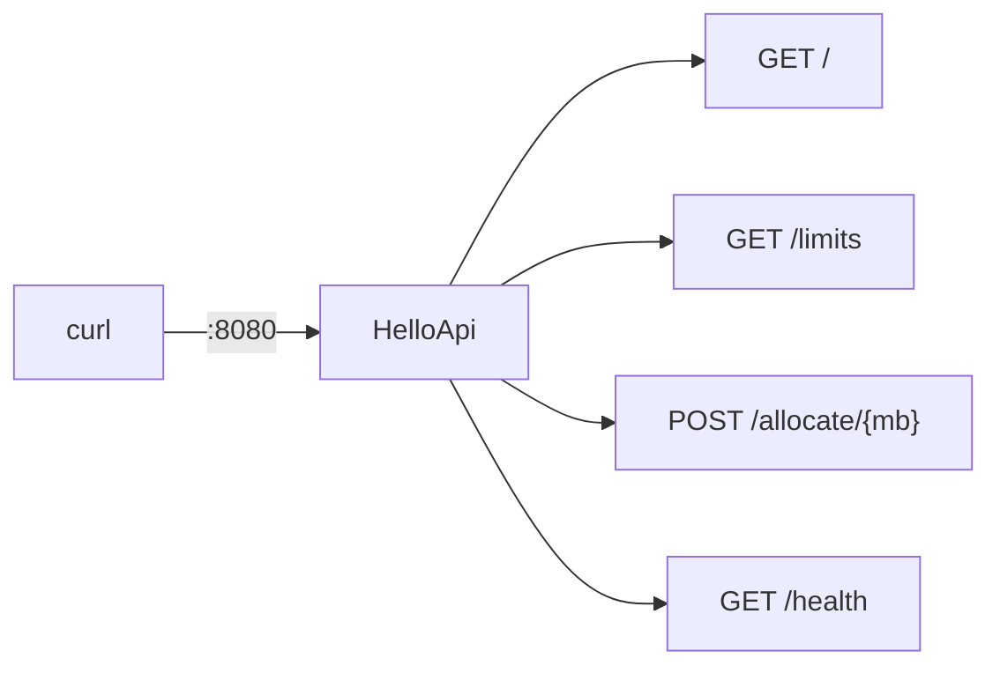

# Example 01 — Hello .NET

> Minimal ASP.NET Core 10 API used by docs 05–13 to prove every claim with real output.



| Endpoint | Returns | Used in |
|---|---|---|
| `GET /` | Greeting + container ID + environment | [12](../../docs/03-containers/12-env-ports.md) |
| `GET /limits` | GC heap limit + CPUs seen by .NET | [13](../../docs/03-containers/13-limits.md) |
| `POST /allocate/{mb}` | Leaks N MB of managed memory | [13](../../docs/03-containers/13-limits.md) |
| `POST /allocate/{mb}?native=true` | Leaks N MB of native memory | [13](../../docs/03-containers/13-limits.md) |
| `GET /health` | `Healthy` | Dockerfile `HEALTHCHECK` |

## Run
```bash
docker build -t hello-dotnet:good .
docker run --rm -p 8080:8080 -e Greeting="Hi" hello-dotnet:good
curl localhost:8080
# {"message":"Hi","machine":"7aad08dba26a","environment":"Production"}
```

## Experiments
```bash
# 1. Size: naive vs multi-stage → 953 MB vs 123 MB (doc 08)
docker build -t hello-dotnet:naive -f Dockerfile.naive .
docker ps -as        # after creating one container from each

# 2. Memory limit: managed leak → 500s, native leak → exit 137 (doc 13)
docker run -d --name oom -p 8080:8080 --memory 256m --memory-swap 256m hello-dotnet:good
curl -X POST localhost:8080/allocate/200                 # 500 OutOfMemoryException
curl -X POST "localhost:8080/allocate/300?native=true"   # container killed
docker inspect oom -f '{{.State.ExitCode}} {{.State.OOMKilled}}'   # 137 true
```

| File | Purpose |
|---|---|
| `Dockerfile` | ✅ Multi-stage, cached, non-root, healthcheck |
| `Dockerfile.naive` | ❌ Single-stage SDK image, shell-form entrypoint (for comparison) |
| `.dockerignore` | Keeps `bin/`, `obj/`, `.git/` out — without it the build **fails** (doc 09) |
