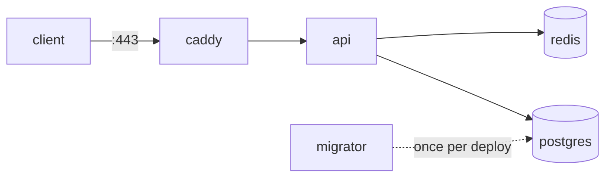

# Example 02 — Notes API (.NET 10 + Postgres + Redis)

> A small production-shaped API used by docs 18–53: Compose for dev, a hardened prod stack, CI, zero-downtime rollout, backups, and tests — all run locally.



## Endpoints
| Method | Path | Does |
|---|---|---|
| GET | `/` | Service, `APP_VERSION`, container ID |
| GET | `/notes` | Cache-aside: Redis → Postgres (`X-Cache: HIT/MISS`) |
| POST | `/notes` | `{"text":"…"}` → insert + invalidate cache |
| GET | `/health` | Postgres + Redis reachable → `Healthy` / 503 |

## Dev
```bash
docker compose up -d --build --wait
curl -X POST localhost:8080/notes -H 'Content-Type: application/json' -d '{"text":"hi"}'
curl -i localhost:8080/notes
```

## Prod Rehearsal on Your Laptop
```bash
docker build --target runtime  --build-arg APP_VERSION=v1 -t local/notes-api:v1 .
docker build --target migrator -t local/notes-migrator:v1 .
# secrets/ → see secrets/README.md ; .env → DOMAIN=localhost REGISTRY=local
SKIP_PULL=1 ./deploy.sh v1
curl -k https://localhost/
./probe.sh &  SKIP_PULL=1 ./rollout.sh v2 ; touch probe.stop   # 0 failed requests
./rollback.sh
./backup.sh
```

## Tests
```bash
cd tests/Api.Tests && dotnet test      # Testcontainers: real postgres:17-alpine
```

## Files
| File | Purpose | Doc |
|---|---|---|
| `Dockerfile` | `runtime` + `migrator` targets | [43](../../docs/09-dotnet-vps/43-dotnet-dockerfile.md) |
| `compose.yml` | Dev: build, ports, healthchecks | [19](../../docs/05-compose/19-multi-service-app.md) |
| `compose.prod.yml` | Prod: images by tag, secrets, limits, logs | [44](../../docs/09-dotnet-vps/44-compose-prod.md) |
| `Caddyfile` | HTTPS + reverse proxy | [27](../../docs/07-deployment/27-reverse-proxy.md) |
| `deploy.sh` / `rollout.sh` / `rollback.sh` | Deploy, zero-downtime, undo | [29](../../docs/07-deployment/29-zero-downtime.md), [47](../../docs/09-dotnet-vps/47-rollback.md) |
| `backup.sh` | `pg_dump` + rotation | [32](../../docs/07-deployment/32-backups.md) |
| `probe.sh` | Measures failed requests during deploys | [29](../../docs/07-deployment/29-zero-downtime.md) |
| `.github/workflows/deploy.yml` | Build → scan → push → rollout | [35](../../docs/08-modern-tools/35-ghcr-actions.md), [46](../../docs/09-dotnet-vps/46-cicd.md) |
| `.devcontainer/` | VS Code dev container | [40](../../docs/08-modern-tools/40-dev-test.md) |
| `tests/Api.Tests` | Testcontainers integration test | [40](../../docs/08-modern-tools/40-dev-test.md) |
| `secrets/README.md` | How to create the secret files | [26](../../docs/07-deployment/26-secrets.md) |
