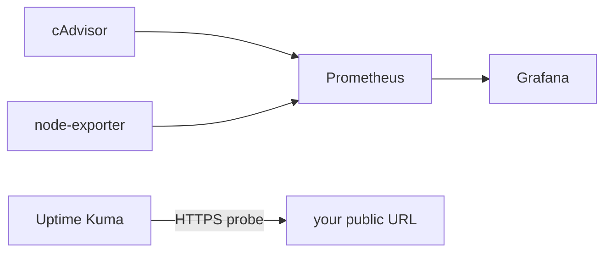

# Example 03 — Monitoring

> Prometheus + Grafana + cAdvisor + node-exporter + Uptime Kuma for one Docker host (doc [31](../../docs/07-deployment/31-monitoring.md)).



## Run
```bash
docker compose up -d
# on a VPS, from your laptop:
ssh -L 3000:localhost:3000 -L 9090:localhost:9090 -L 3001:localhost:3001 deploy@your-vps
```

| UI | URL | First step |
|---|---|---|
| Grafana | http://localhost:3000 | `admin`/`admin` → change password → import dashboard 1860 |
| Prometheus | http://localhost:9090 | Status → Targets: `cadvisor`, `node` UP |
| Uptime Kuma | http://localhost:3001 | Add HTTPS monitor for your API |

## Validated
| Check | Result |
|---|---|
| `docker compose config -q` | ✅ |
| `promtool check config prometheus.yml` | ✅ SUCCESS |
| Image tags exist (`imagetools inspect`) | ✅ all 5 |

Not run long-term here: cAdvisor/node-exporter need a Linux host for full metrics.
